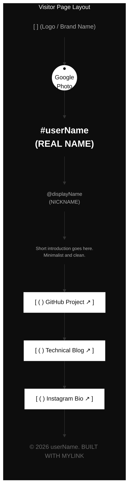
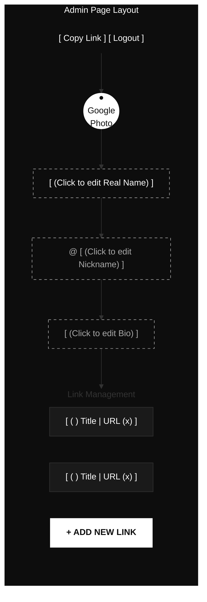

# [WIREFRAME] 마이링크 (MyLink) 와이어프레임

본 문서는 ASALDESIGN 시스템(고대비 미니멀리즘)을 기반으로 한 마이링크의 구조를 Mermaid 다이어그램을 통해 시각화합니다.

---

## 1. 공개 프로필 뷰 (Visitor View)
방문자가 접속했을 때 보게 되는 최종 결과물입니다.

---

## 2. 관리자 편집 뷰 (Admin/Owner View)
소유자가 로그인 후 인라인 편집을 수행하는 화면입니다.

---

## 3. 레이아웃 상세 설명

### 3.1 공통 레이아웃 (Layout Rules)
- **배경**: 모든 페이지는 `#0D0D0D` (완전한 검정에 가까운 다크) 배경을 사용합니다.
- **색상 대비**: 텍스트는 주로 흰색(`#FFFFFF`) 또는 회색(`#AAAAAA`)을 사용하며, 버튼과 카드 섹션은 흰색 배경에 검정 글씨를 사용하여 시각적 위계를 만듭니다.

### 3.2 인라인 편집 인터페이스 (Inline UI)
- **편집 모드**: 소유자가 텍스트를 클릭하면 즉시 `<input>` 또는 `<textarea>`로 전환됩니다.
- **저장 및 취소**: `Enter` 키를 누르거나 입력 필드 외부를 클릭하면 즉시 Firebase Firestore에 저장됩니다.

### 3.3 링크 블록 구조 (Link Block)
- **파비콘**: 각 링크 블록 좌측의 `( )` 영역에 Google Favicon API로 불러온 아이콘이 배치됩니다.
- **삭제 버튼**: 관리자 뷰에서만 각 링크 블록 우측에 `(x)` 아이콘이 노출되어 즉시 삭제가 가능합니다.
