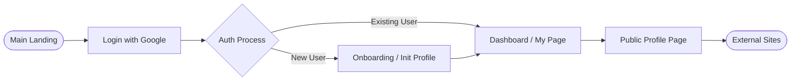
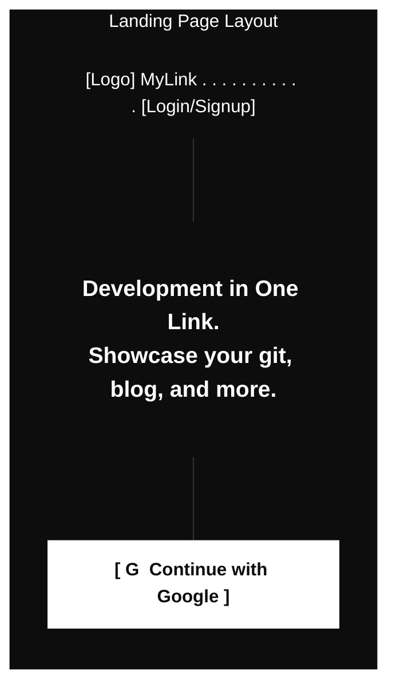
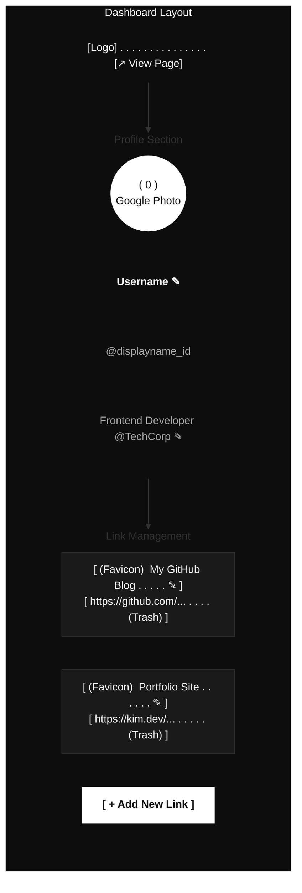
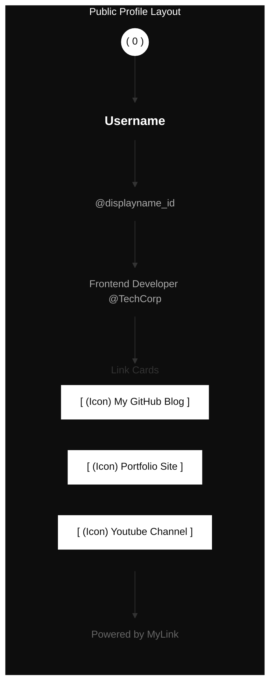

# [WIREFRAME] MyLink Wireframe

This document visualizes the screen structure and flow of MyLink, to which the ASALDESIGN system (high-contrast minimalism) is applied, based on the screenshot design plan provided by the user.

---

## 1. User Flow

---

## 2. Wireframe by Screen

### 2.1 Landing Page
A simple and powerful service entry page.

### 2.2 Dashboard / My Page (Dashboard - Admin)
The core screen where the owner manages their profile and links.

### 2.3 Public Profile (Public Profile - Visitor)
The read-only page that visitors will see. It is displayed cleanly without editing tools.

---

## 3. Key Design Principles

1.  **Inline Editing Indication**: In the admin view, the `✎` (pencil icon) next to text indicates that it can be modified immediately upon clicking.
2.  **High-Contrast Layout**: Maximize visual contrast by setting the background dark and major content cards and buttons bright (ASALDESIGN system).
3.  **Simple Deletion**: Provides immediate deletion feedback via the trash icon `(Trash)` within the link block.
4.  **Branding**: Maintains service identity by placing "Powered by MyLink" at the bottom.
