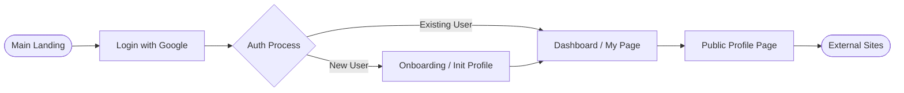
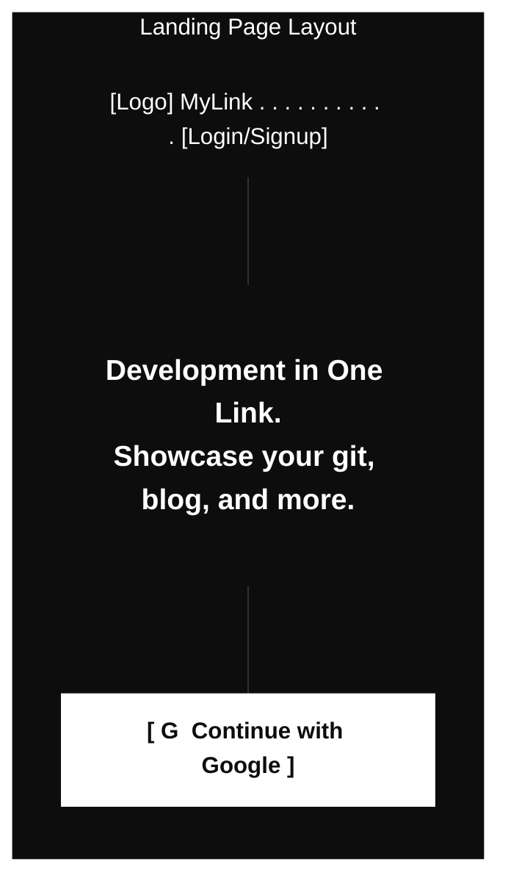
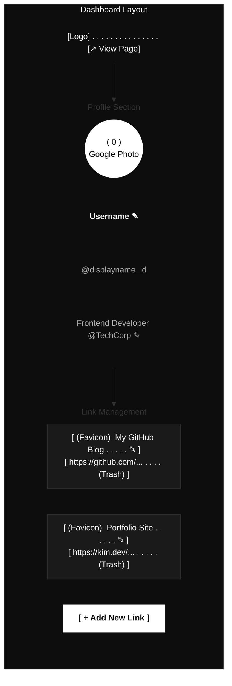
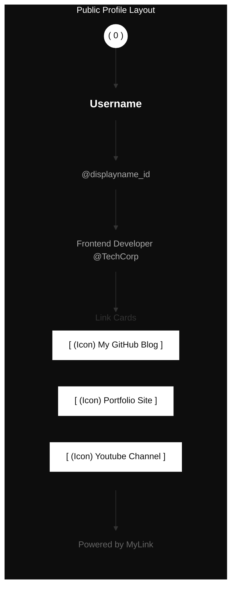

# [WIREFRAME] 마이링크 (MyLink) 와이어프레임

본 문서는 사용자가 제공한 스크린샷 설계안을 바탕으로, ASALDESIGN 시스템(고대비 미니멀리즘)이 적용된 마이링크의 화면 구조와 흐름을 시각화합니다.

---

## 1. 서비스 흐름 (User Flow)

---

## 2. 화면별 와이어프레임

### 2.1 메인 랜딩 (Landing Page)
심플하고 강렬한 인상을 주는 서비스 진입 페이지입니다.

### 2.2 대시보드 / 마이페이지 (Dashboard - Admin)
소유자가 자신의 프로필과 링크를 관리하는 핵심 화면입니다.

### 2.3 공개 프로필 (Public Profile - Visitor)
방문자가 보게 될 읽기 전용 페이지입니다. 편집 도구 없이 깔끔하게 표시됩니다.

---

## 3. 주요 설계 원칙

1.  **인라인 편집 표시**: 관리자 뷰에서 텍스트 옆의 `✎` (연필 아이콘)는 클릭 시 즉시 수정이 가능함을 나타냅니다.
2.  **고대비 레이아웃**: 배경은 어둡게, 주요 콘텐츠 카드와 버튼은 밝게 설정하여 시각적 대비를 극대화합니다 (ASALDESIGN 시스템).
3.  **심플한 삭제**: 링크 블록 내의 쓰레기통 아이콘`(Trash)`을 통해 즉각적인 삭제 피드백을 제공합니다.
4.  **브랜딩**: 하단에 "Powered by MyLink"를 배치하여 서비스의 정체성을 유지합니다.
